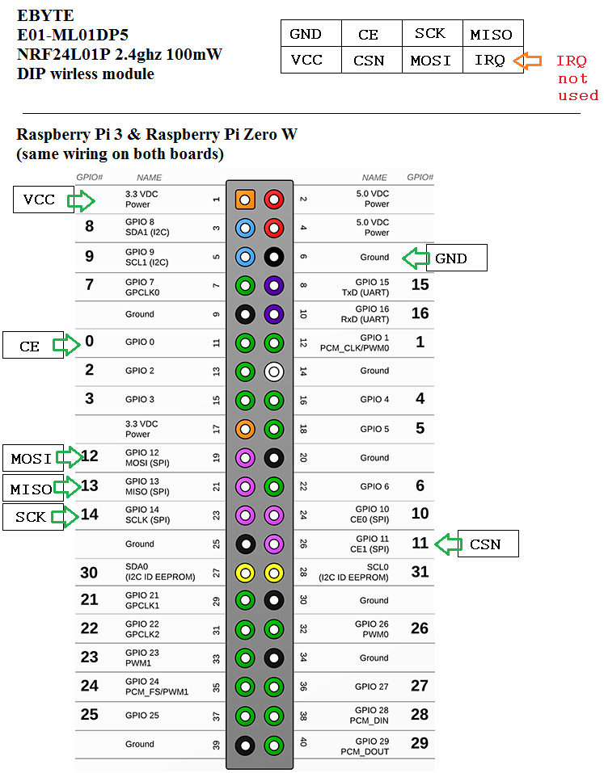

# RPI NRF24L01 #

Allows two RPI's to communicate with cheap 2.GHz transceivers.

Include "lib_nrf24.py" in your scripts.

"send.py" and "recv.py" should be run on two different RPI's. Everything should work if wired up as shown.

Based on:

[https://github.com/maniacbug/RF24/](https://github.com/maniacbug/RF24/)

and:

[https://github.com/jpbarraca/pynrf24](https://github.com/jpbarraca/pynrf24)

and:

[https://github.com/BLavery/lib_nrf24](https://github.com/BLavery/lib_nrf24)

----------

**Wiring diagram:**

